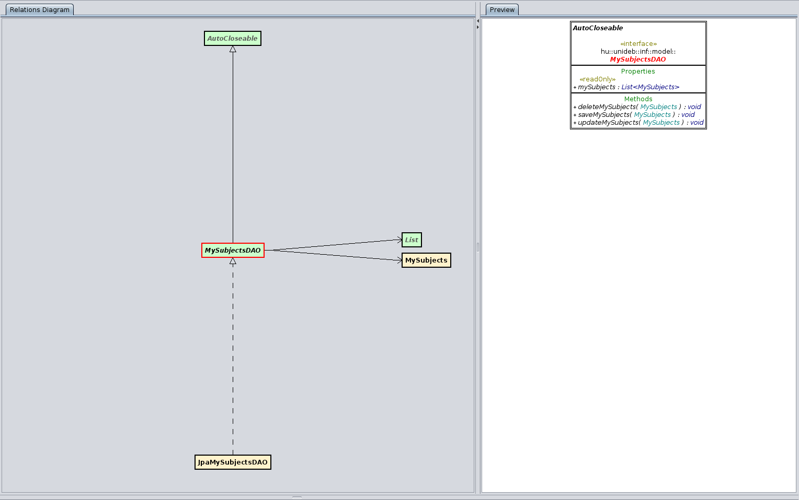
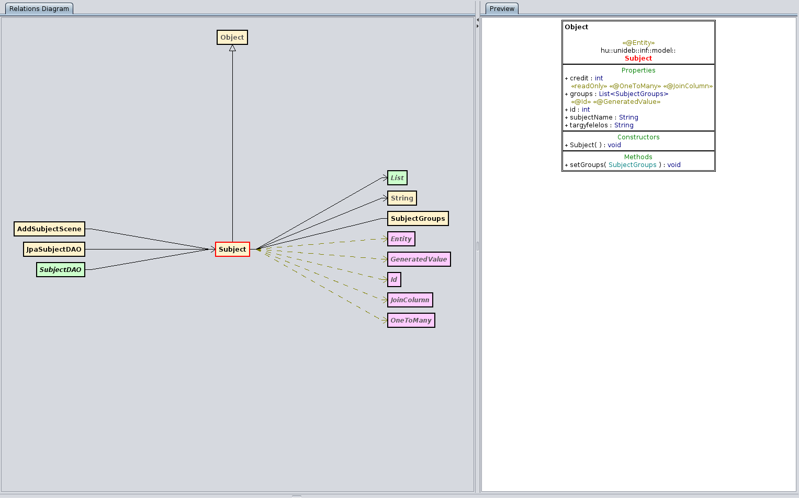
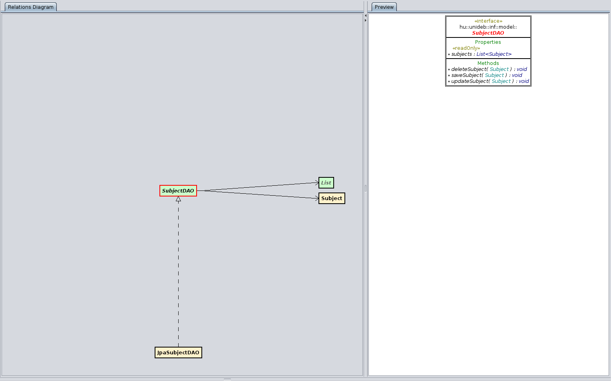

# Diagrammok a különböző objektumokról

## AddGroupToSubjectController

## AddSubjectScene

## AfterRegisterSceneController

## Container

## JpaMySubjectsDAO

## JpaPersonDAO

## JpaStudentDAO

## JpaSubjectDAO

## JpaSubjectGroupDAO

## JpaTeacherDAO

## LoginSceneController

## Main

## MainApp

## MenuSceneController

## Model

## MySubjects

## MySubjectsDAO

## Person

## PersonDAO

## RegisterSceneController

## RoleType

## Student

## StudentDAO

## Subject

## SubjectDAO

## SubjectGroups

## SubjectGroupsDAO

## TargyfelvetelController

## Teacher

## TeacherDAO
