# SFM_Orarendtervezo
> Szoftverfejlesztés mérnököknek - Projektmunka
# Történet a program fejlesztéséről.

## torokrobert99 - 2022, Mar 25, 12:12 PM GMT+1
### Egy alap program az órarendtervező projekthez(1 Scene, kód implementáció nélkül)
>commit: b0425af35d6d4607905c1ad296d96b93ff24235c

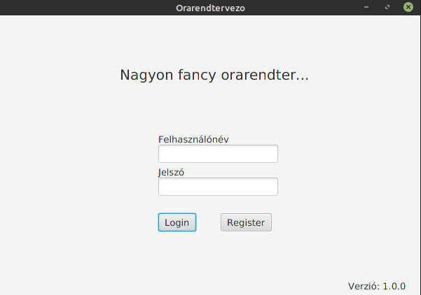
## VictorBuscsei - 2022, Mar 27, 12:34 PM GMT+2
### JUnit fix
>commit: 7ab7dc174acf9aec49204634f4bf4e7f58659394

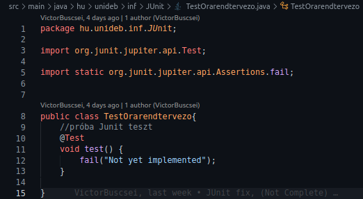
## torokrobert99 - 2022, Mar 28, 11:16 PM GMT+2
### Regisztrációs felület hozzáadása: Controller class, fxml, Scene
>commit: f0b6ddf2ea4d526a66b8f13659e73672025d4b86

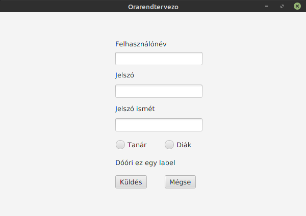
## VictorBuscsei - 2022, Mar 31, 1:15 PM GMT+2 + torokrobert99 - 2022, Mar 31, 7:19 PM GMT+2
### H2-es adatbázis és DAO-k hozzáadása + Adatbázis update
>commit: 7a0d724857d4f98659fe05811984337423a4da20 + ef5dda6b4fde674f426b1a6f8c8bb8bcc5340e74

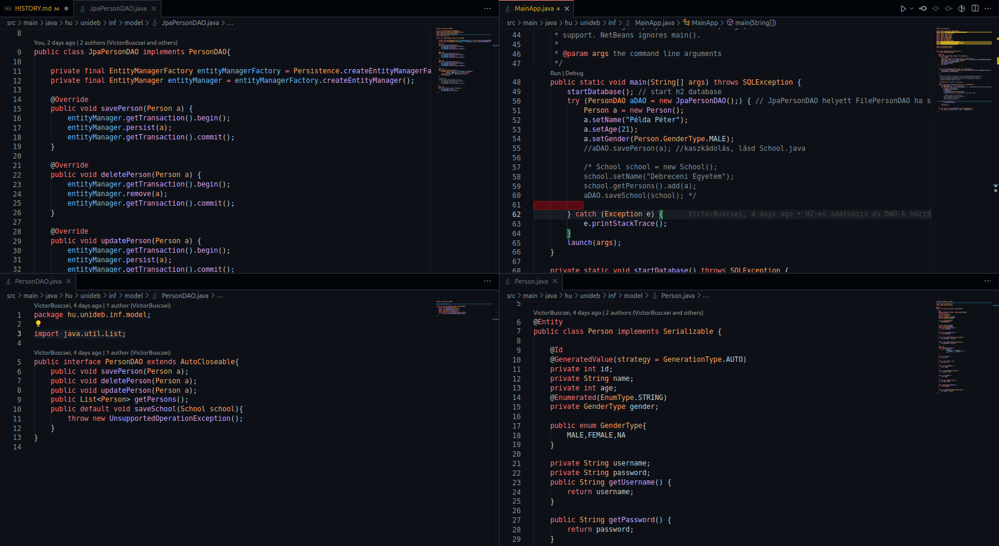
## VictorBuscsei - 2022, Apr 2, 5:48 PM GMT+2
### Added Teacher, Student and Subject classes
>commit: d9573daf19cec00f5c3f72764d165aaed7384f46

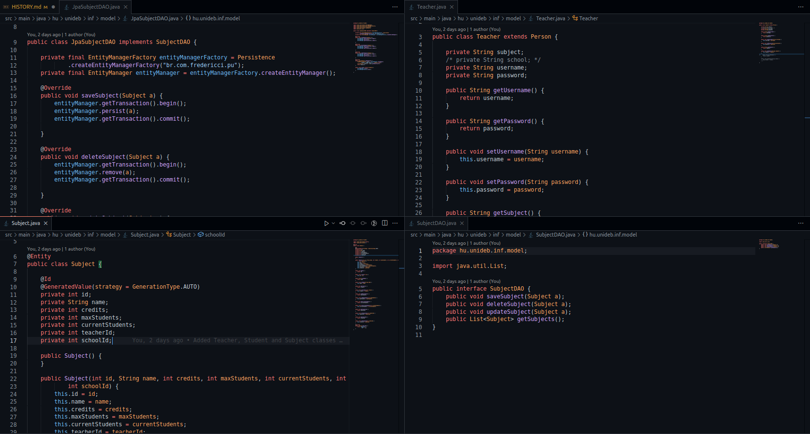
## Aldora2001 - 2022, Apr 3, 7:27 PM GMT+2
### Added fxml
>commit: fd7ef094ca0153c0677064fcfd4b3d51e9e694da

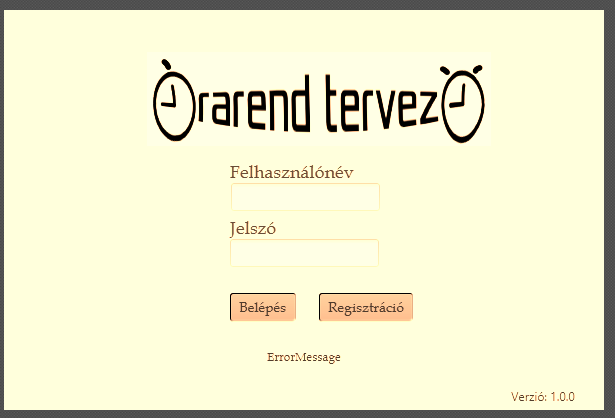
## torokrobert99 - 2022, Apr 4, 7:12 PM GMT+2
### Regisztrációs felület tervezésének befejezése
>commit: f3bb48a93dd85a292460f551cb2ae3222d6d4c7c

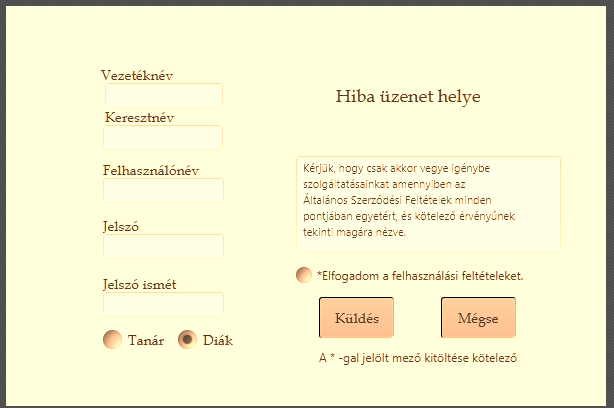
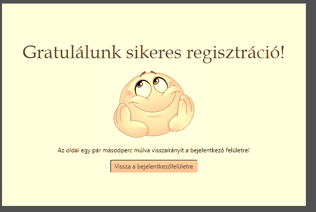
## czegenypatrik - 2022, May 6, 2:43 PM GMT+2
### Menü frontend oldali létrehozása, tanár/diák menü közös felűlet.
>commit: a5de13b4a7b2398979fcce3931d3918a46ce7698

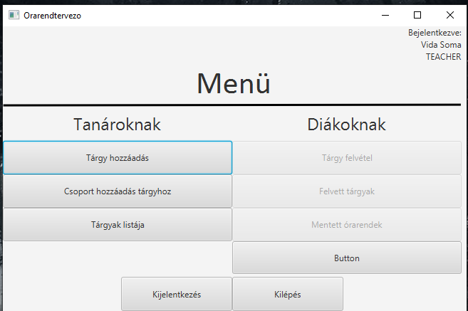
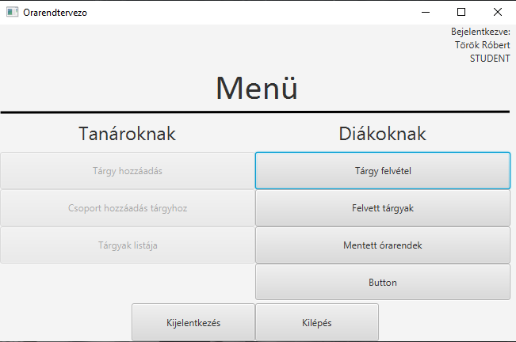
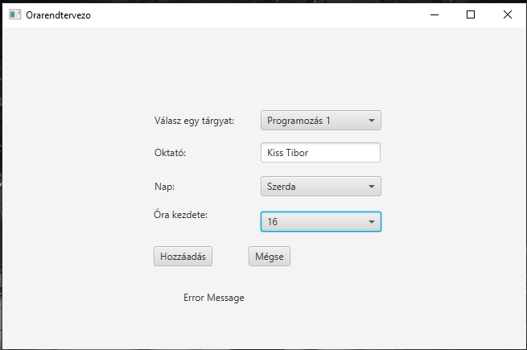

## czegenypatrik - 2022, May 13, 8:18 PM GMT+2
### Tárgyfelvétel Scene skeletonjának elkészítése.
>commit: c19d51ab149ef0b285c25a7dc3bce1fc20330dd1

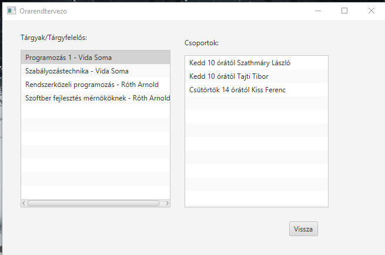

