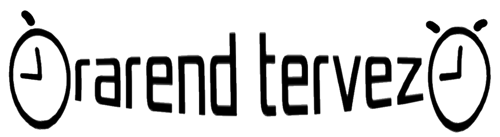

[![Contributors][contributors-shield]][contributors-url]
[![Forks][forks-shield]][forks-url]
[![Stargazers][stars-shield]][stars-url]
[![Issues][issues-shield]][issues-url]
[![MIT License][license-shield]][license-url]

<!-- PROJECT LOGO -->
 

  

  <h3 align="center">SFM_Orarendtervezo</h3>

  

    Szoftverfejlesztés mérnököknek - Projektmunka by: &#8730;erek
     

## 📖 Tartalomjegyzék
- [📖 Tartalomjegyzék](#-tartalomjegyzék)
- [☝️ Általános információ](#️-általános-információ)
- [💻 Képernyőképek](#-képernyőképek)
- [📝 Fejlesztés törénete](#-fejlesztés-törénete)
- [📝 Diagrammok objektumokról](#-diagrammok-objektumokról)
- [📝 Written in](#-written-in)
- [💡 Állapot](#-állapot)
- [⚠️ Licenc](#️-licenc)
- [⭐️ Kapcsolat](#️-kapcsolat)

## ☝️ Általános információ
Órarendtervező "alkalmazás" Java alatt, mavennel - Szoftverfejlesztés mérnököknek projekt.

## 💻 Képernyőképek

## 📝 Fejlesztés törénete
A fejlesztés történetét `HISTORY.md` fájlban található vagy [itt](https://github.com/torokrobert99/SFM_Orarendtervezo/blob/main/HISTORY.md) megtalálható!

## 📝 Diagrammok objektumokról
A diagrammokat az objektumokról `DIAGRAMS.md` fájlban található vagy [itt](https://github.com/torokrobert99/SFM_Orarendtervezo/blob/main/DIAGRAMS.md) megtalálható!
## 📝 Written in
Java with Maven.
## 💡 Állapot
Projekt az : _Alpha tesztelésre kész_

<!-- LICENSE -->
## ⚠️ Licenc

Terjesztve az MIT Licenc alatt. További információért lásd a  `LICENSE.md` -fájlban
## ⭐️ Kapcsolat
Készítették: [@torokrobert99](https://github.com/torokrobert99), [@Aldora2001](https://github.com/Aldora2001), [@czegenypatrik](https://github.com/czegenypatrik), [@Xenole](https://github.com/Xenole) és [@VictorBuscsei](https://github.com/VictorBuscsei) 

<!-- MARKDOWN LINKS & IMAGES -->
<!-- https://www.markdownguide.org/basic-syntax/#reference-style-links -->
[contributors-shield]: https://img.shields.io/github/contributors/torokrobert99/SFM_Orarendtervezo.svg?style=for-the-badge
[contributors-url]: https://github.com/torokrobert99/SFM_Orarendtervezo/graphs/contributors
[forks-shield]: https://img.shields.io/github/forks/torokrobert99/SFM_Orarendtervezo.svg?style=for-the-badge
[forks-url]: https://github.com/torokrobert99/SFM_Orarendtervezo/network/members
[stars-shield]: https://img.shields.io/github/stars/torokrobert99/SFM_Orarendtervezo.svg?style=for-the-badge
[stars-url]: https://github.com/torokrobert99/SFM_Orarendtervezo/stargazers
[issues-shield]: https://img.shields.io/github/issues/torokrobert99/SFM_Orarendtervezo.svg?style=for-the-badge
[issues-url]: https://github.com/torokrobert99/SFM_Orarendtervezo/issues
[license-shield]: https://img.shields.io/github/license/torokrobert99/SFM_Orarendtervezo.svg?style=for-the-badge
[license-url]: https://github.com/torokrobert99/SFM_Orarendtervezo/blob/master/LICENSE.md

<!-- Nem engedik, hogy Hunglishben commitoljak:( By:VB-->